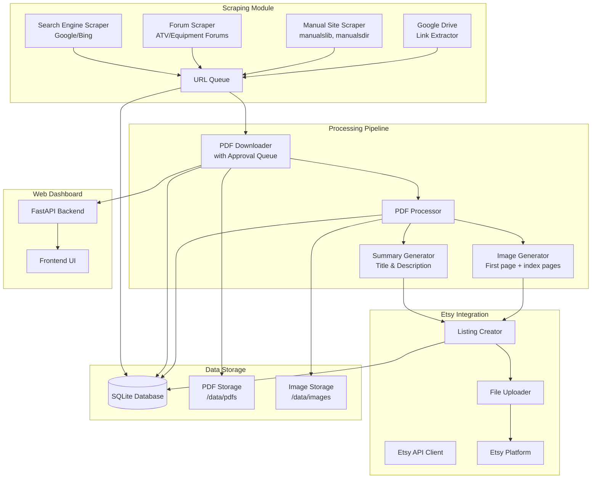
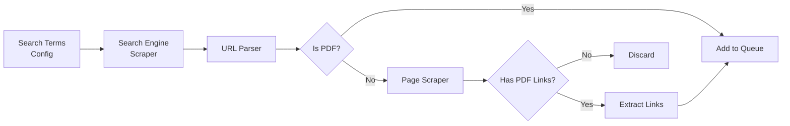
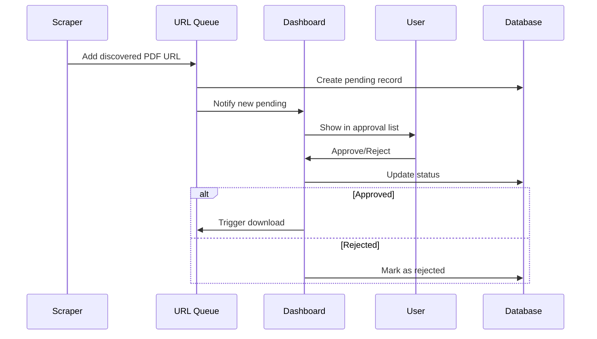
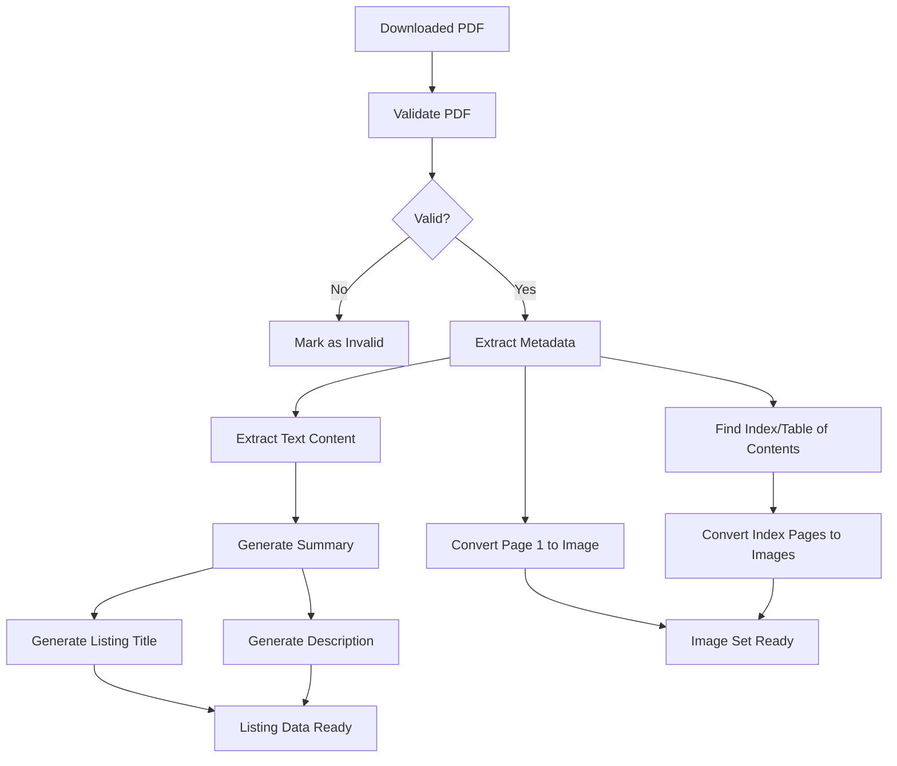
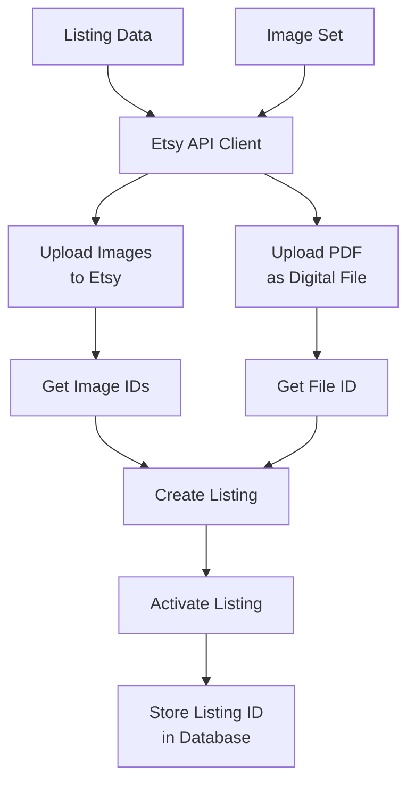

# AutoLister - Architecture Plan

## Project Overview

AutoLister is a Python-based application that runs on Raspberry Pi to automatically scrape PDF manuals for equipment (ATVs, lawnmowers, tractors, generators, etc.), process them for Etsy listings, and create listings with digital download capabilities.

## Technology Stack

### Backend Framework
- **Python 3.11+** - Primary language
- **FastAPI** - Web framework for dashboard and API endpoints
- **Celery + Redis** - Background task scheduling and queue management
- **SQLite** - Local database (can be upgraded to PostgreSQL if needed)

### Key Libraries
- **BeautifulSoup4 / Scrapy** - Web scraping
- **Selenium / Playwright** - JavaScript-heavy page scraping
- **PyPDF2 / pdfplumber** - PDF processing and text extraction
- **Pillow (PIL)** - Image processing
- **requests** - HTTP client
- **Etsy Open API Python SDK** - Etsy integration

### Frontend
- **HTML/CSS/JavaScript (Vanilla)** - Simple dashboard interface
- **Bootstrap 5** - UI framework for responsive design

### Deployment
- **Docker** - Containerization for Raspberry Pi
- **Docker Compose** - Multi-container orchestration

## System Architecture



## Component Details

### 1. Scraping Module

#### Search Sources
- **Search Engines**: Google Custom Search API, Bing Search API
- **Forums**: ATV forums, equipment forums, manufacturer forums
- **Manual Sites**: manualslib.com, manualsdir.com, manualsonline.com
- **Google Drive**: Extract direct download links from forum posts

#### Scraper Architecture


### 2. Approval Workflow



### 3. PDF Processing Pipeline



### 4. Etsy Integration



## Database Schema

### Tables

#### manuals
```sql
CREATE TABLE manuals (
    id INTEGER PRIMARY KEY AUTOINCREMENT,
    source_url TEXT NOT NULL,
    source_type TEXT NOT NULL,  -- 'search', 'forum', 'manual_site', 'gdrive'
    title TEXT,
    equipment_type TEXT,
    manufacturer TEXT,
    model TEXT,
    year TEXT,
    status TEXT NOT NULL,  -- 'pending', 'approved', 'rejected', 'downloaded', 'processed', 'listed', 'error'
    pdf_path TEXT,
    created_at TIMESTAMP DEFAULT CURRENT_TIMESTAMP,
    updated_at TIMESTAMP DEFAULT CURRENT_TIMESTAMP,
    error_message TEXT
);
```

#### etsy_listings
```sql
CREATE TABLE etsy_listings (
    id INTEGER PRIMARY KEY AUTOINCREMENT,
    manual_id INTEGER NOT NULL,
    listing_id INTEGER UNIQUE,
    title TEXT NOT NULL,
    description TEXT NOT NULL,
    price REAL NOT NULL,
    quantity INTEGER DEFAULT 1,
    status TEXT NOT NULL,  -- 'draft', 'active', 'inactive', 'sold_out'
    etsy_file_id INTEGER,
    created_at TIMESTAMP DEFAULT CURRENT_TIMESTAMP,
    updated_at TIMESTAMP DEFAULT CURRENT_TIMESTAMP,
    FOREIGN KEY (manual_id) REFERENCES manuals(id)
);
```

#### etsy_images
```sql
CREATE TABLE etsy_images (
    id INTEGER PRIMARY KEY AUTOINCREMENT,
    listing_id INTEGER NOT NULL,
    etsy_image_id INTEGER,
    image_path TEXT NOT NULL,
    is_primary BOOLEAN DEFAULT FALSE,
    sort_order INTEGER DEFAULT 0,
    FOREIGN KEY (listing_id) REFERENCES etsy_listings(id)
);
```

#### processing_logs
```sql
CREATE TABLE processing_logs (
    id INTEGER PRIMARY KEY AUTOINCREMENT,
    manual_id INTEGER,
    stage TEXT NOT NULL,  -- 'scrape', 'download', 'process', 'list'
    status TEXT NOT NULL,  -- 'started', 'completed', 'failed'
    message TEXT,
    created_at TIMESTAMP DEFAULT CURRENT_TIMESTAMP,
    FOREIGN KEY (manual_id) REFERENCES manuals(id)
);
```

## Project Structure

```
AutoLister/
├── app/
│   ├── __init__.py
│   ├── main.py                 # FastAPI application entry point
│   ├── config.py               # Configuration management
│   ├── database.py             # Database connection and models
│   ├── api/
│   │   ├── __init__.py
│   │   ├── routes.py           # API endpoints
│   │   └── schemas.py          # Pydantic models
│   ├── scrapers/
│   │   ├── __init__.py
│   │   ├── base.py             # Base scraper class
│   │   ├── search_engine.py    # Google/Bing scraper
│   │   ├── forums.py           # Forum scraper
│   │   ├── manual_sites.py     # Manual site scraper
│   │   └── gdrive.py           # Google Drive extractor
│   ├── processors/
│   │   ├── __init__.py
│   │   ├── pdf_handler.py      # PDF download and validation
│   │   ├── pdf_processor.py    # PDF text/image extraction
│   │   └── summary_gen.py      # Title and description generation
│   ├── etsy/
│   │   ├── __init__.py
│   │   ├── client.py           # Etsy API client
│   │   ├── auth.py             # OAuth authentication
│   │   └── listing.py          # Listing creation and management
│   ├── tasks/
│   │   ├── __init__.py
│   │   ├── scheduler.py        # Celery beat scheduler
│   │   └── jobs.py             # Background task definitions
│   └── static/
│       ├── css/
│       │   └── dashboard.css
│       ├── js/
│       │   └── dashboard.js
│       └── index.html          # Dashboard UI
├── data/
│   ├── pdfs/                   # Downloaded PDFs
│   ├── images/                 # Generated images
│   └── autolister.db           # SQLite database
├── tests/
│   ├── __init__.py
│   ├── test_scrapers.py
│   ├── test_processors.py
│   └── test_etsy.py
├── config/
│   ├── config.yaml             # Main configuration
│   └── search_terms.yaml       # Search term definitions
├── docker/
│   ├── Dockerfile
│   └── docker-compose.yml
├── requirements.txt
├── .env.example
├── .gitignore
└── README.md
```

## Configuration Structure

### config.yaml
```yaml
app:
  name: AutoLister
  version: 1.0.0
  debug: false

scraping:
  interval_hours: 6
  max_results_per_search: 20
  user_agent: AutoLister/1.0
  timeout: 30

search_engines:
  google:
    api_key: ${GOOGLE_API_KEY}
    cx: ${GOOGLE_CX}
  bing:
    api_key: ${BING_API_KEY}

forums:
  - name: ATVConnection
    url: https://www.atvconnection.com
  - name: LawnMowerForum
    url: https://www.lawnmowerforum.com

manual_sites:
  - name: ManualsLib
    url: https://www.manualslib.com
  - name: ManualsDir
    url: https://www.manualsdir.com

etsy:
  api_key: ${ETSY_API_KEY}
  api_secret: ${ETSY_API_SECRET}
  access_token: ${ETSY_ACCESS_TOKEN}
  access_token_secret: ${ETSY_ACCESS_TOKEN_SECRET}
  shop_id: ${ETSY_SHOP_ID}
  default_price: 4.99
  default_quantity: 9999

processing:
  max_pdf_size_mb: 50
  image_dpi: 150
  image_format: jpeg
  main_image_page: 1
  additional_image_pages: [2, 3, 4]  # Will try to find index

database:
  path: ./data/autolister.db

dashboard:
  host: 0.0.0.0
  port: 8000
```

### search_terms.yaml
```yaml
equipment_categories:
  - name: ATV/UTV
    brands: [Honda, Yamaha, Polaris, Suzuki, Kawasaki, Can-Am]
    types: [ATV, UTV, Side by Side, Quad]
    keywords: [manual, service manual, owner manual, repair manual]
  
  - name: Lawnmowers
    brands: [Toro, Craftsman, John Deere, Honda, Husqvarna]
    types: [Lawn Mower, Riding Mower, Push Mower, Zero Turn]
    keywords: [manual, service manual, owner manual]
  
  - name: Tractors
    brands: [John Deere, Kubota, Massey Ferguson, New Holland]
    types: [Tractor, Compact Tractor, Farm Tractor]
    keywords: [manual, service manual, operator manual]
  
  - name: Generators
    brands: [Honda, Generac, Champion, Westinghouse]
    types: [Generator, Portable Generator, Inverter Generator]
    keywords: [manual, owner manual, service manual]
```

## API Endpoints

### Dashboard API
```
GET  /api/pending          - List pending manuals for approval
POST /api/pending/{id}/approve - Approve a manual
POST /api/pending/{id}/reject  - Reject a manual
GET  /api/manuals          - List all manuals
GET  /api/manuals/{id}     - Get manual details
GET  /api/listings          - List Etsy listings
POST /api/listings/{id}/activate - Activate a listing
POST /api/listings/{id}/deactivate - Deactivate a listing
GET  /api/stats            - System statistics
```

## Etsy API Research Notes

### Required Research
1. **Digital Download Support**: Verify if Etsy API supports digital file uploads
2. **Image Upload Limits**: Check maximum number of images per listing
3. **File Size Limits**: Verify maximum PDF file size
4. **Listing Creation Flow**: Understand the exact API sequence
5. **OAuth Flow**: Implement proper authentication

### Potential Limitations
- Etsy may not support digital downloads via API (may require manual upload)
- Image upload may have specific requirements (dimensions, format)
- Rate limiting may affect bulk listing creation

## Deployment Considerations for Raspberry Pi

### Resource Optimization
- Use lightweight image processing libraries
- Implement PDF size limits
- Batch processing to avoid memory issues
- Monitor disk usage (PDF storage)

### Security
- Environment variables for sensitive data
- Dashboard authentication
- HTTPS for remote access
- Rate limiting on API endpoints

### Monitoring
- Logging all operations
- Error tracking
- Disk space monitoring
- Task queue monitoring

## Next Steps

1. Research Etsy API capabilities thoroughly
2. Set up project structure
3. Implement basic scraper for one source
4. Build approval dashboard
5. Implement PDF processing
6. Integrate with Etsy API
7. Deploy to Raspberry Pi
